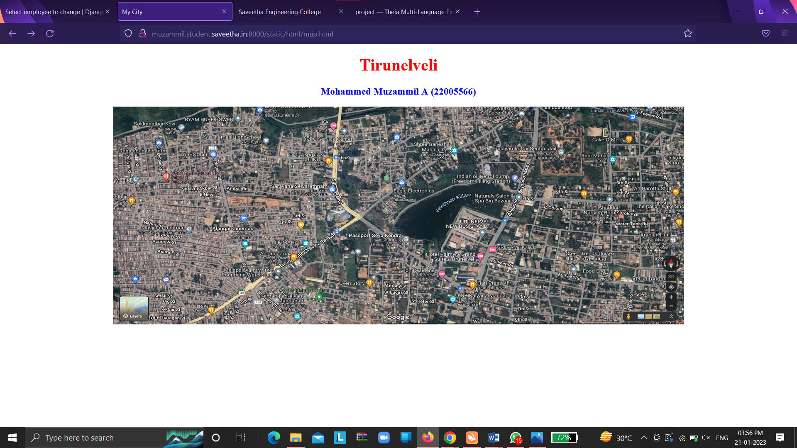
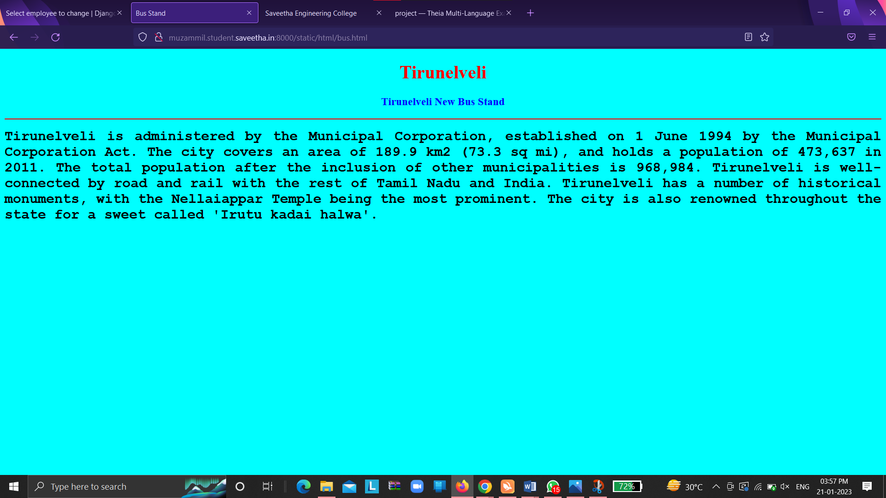
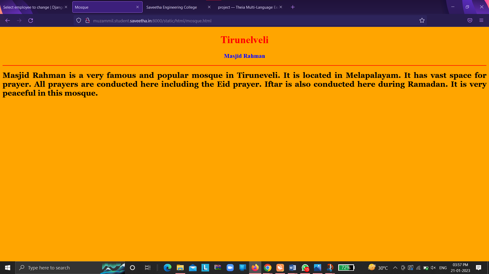
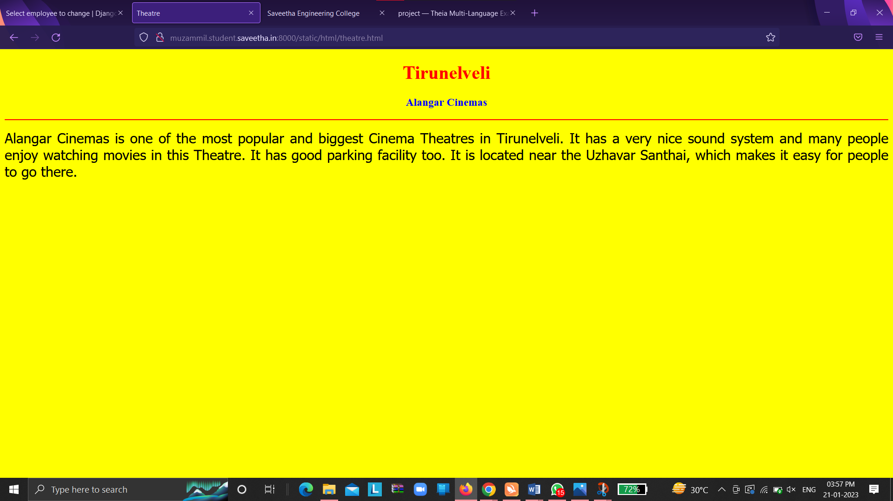
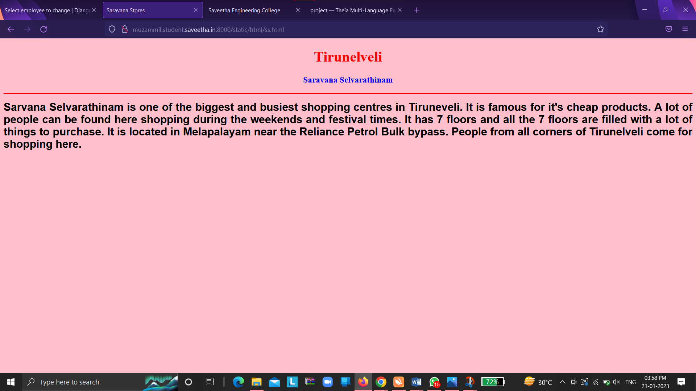
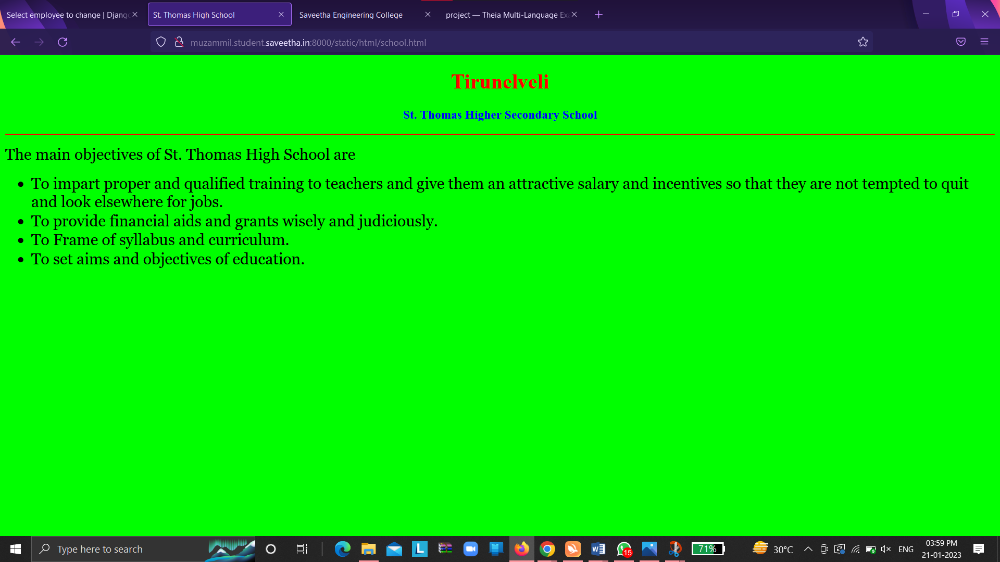
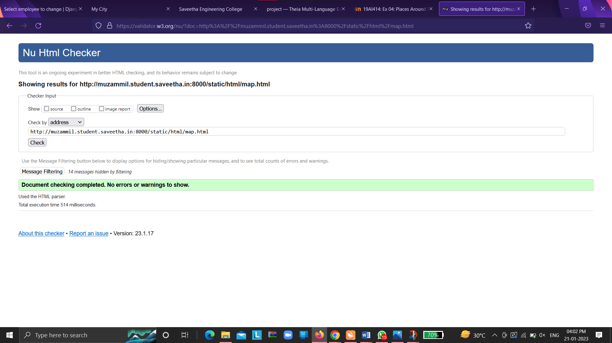

# Places Around Me
## AIM:
To develop a website to display details about the places around my house.

## Design Steps:

### Step 1:
Clone the github repository into Theia IDE

### Step 2:
Create a new Django project

### Step 3:
Write the needed HTML code.

### Step 4:
Run the Django server and execute the HTML files

## Code:
```
map.html
<!DOCTYPE html>
<html lang="en">
<head>
<title>My City</title>
</head>
<body>
<h1 align="center">
<font color="red"><b>Tirunelveli</b></font>
</h1>
<h3 align="center">
<font color="blue"><b>Mohammed Muzammil A (22005566)</b></font>
</h3>
<center>

<map name="MyCity">
<area shape="circle" coords="190,50,20" href="/static/html/school.html" title="St.Thomas High School">
<area shape="rectangle" coords="230,30,260,60" href="/static/html/ss.html" title="Saravana Stores">
<area shape="circle" coords="400,350,50" href="/static/html/mosque.html" title="Masjid Rahman">
<area shape="circle" coords="400,200,75" href="/static/html/bus.html" title="Tirunelveli New Bus Stand">
<area shape="rectangle" coords="490,150,870,320" href="/static/html/theatre.html" title="Alangar Cinemas">
</map>
</center>
</body>
</html>

bus.html 
<!DOCTYPE html>
<html lang="en">
<head>
<title>Bus Stand</title>
</head>
<body bgcolor="cyan">
<h1 align="center">
<font color="red"><b>Tirunelveli</b></font>
</h1>
<h3 align="center">
<font color="blue"><b>Tirunelveli New Bus Stand</b></font>
</h3>
<hr size="3" color="red">
<p align="justify">
<font face="Courier New" size="5">
<b>
Tirunelveli is administered by the Municipal Corporation, established on 1 June 1994
by the Municipal Corporation Act. The city covers an area of 189.9 km2 (73.3 sq mi), 
and holds a population of 473,637 in 2011. The total population after the inclusion 
of other municipalities is 968,984. Tirunelveli is well-connected by road and rail
with the rest of Tamil Nadu and India. Tirunelveli has a number of historical monuments, 
with the Nellaiappar Temple being the most prominent. The city is also renowned throughout
the state for a sweet called 'Irutu kadai halwa'. 
</b>
</font>
</p>
</body>
</html>

mosque.html
<!DOCTYPE html>
<html lang="en">
<head>
<title>Mosque</title>
</head>
<body bgcolor="orange">
<h1 align="center">
<font color="red"><b>Tirunelveli</b></font>
</h1>
<h3 align="center">
<font color="blue"><b>Masjid Rahman</b></font>
</h3>
<hr size="3" color="red">
<p align="justify">
<font face="Georgia" size="5">
<b>
Masjid Rahman is a very famous and popular mosque in Tiruneveli. It is located in Melapalayam. 
It has vast space for prayer. All prayers are conducted here including the Eid prayer.
Iftar is also conducted here during Ramadan. It is very peaceful in this mosque.
</b>
</font>
</p>
</body>
</html>

school.html
<!DOCTYPE html>
<html lang="en">
<head>
<title>St. Thomas High School</title>
</head>
<body bgcolor="lime">
<h1 align="center">
<font color="red"><b>Tirunelveli</b></font>
</h1>
<h3 align="center">
<font color="blue"><b>St. Thomas Higher Secondary School</b></font>
</h3>
<hr size="3" color="red">
<p align="justify">
<font face="Georgia" size="5">
The main objectives of St. Thomas High School are 
<ul>
<li>To impart proper and qualified training to teachers and give them an attractive salary and incentives so that they are not tempted to quit and look elsewhere for jobs.</li>
<li>To provide financial aids and grants wisely and judiciously.</li>
<li>To Frame of syllabus and curriculum.</li>
<li>To set aims and objectives of education.</li>
</ul>
</font>
</p>
</body>
</html>

ss.html
<!DOCTYPE html>
<html lang="en">
<head>
<title>Saravana Stores</title>
</head>
<body bgcolor="pink">
<h1 align="center">
<font color="red"><b>Tirunelveli</b></font>
</h1>
<h3 align="center">
<font color="blue"><b>Saravana Selvarathinam</b></font>
</h3>
<hr size="3" color="red">
<p align="justify">
<font face="Arial" size="5">
<b>
Sarvana Selvarathinam is one of the biggest and busiest shopping centres in Tiruneveli. It is famous for it's cheap products.
A lot of people can be found here shopping during the weekends and festival times. It has 7 floors and all the 7 floors are
filled with a lot of things to purchase. It is located in Melapalayam near the Reliance Petrol Bulk bypass. People from all 
corners of Tirunelveli come for shopping here.
</b>
</font>
</p>
</body>
</html>

theatre.html
<!DOCTYPE html>
<html lang="en">
<head>
<title>Theatre</title>
</head>
<body bgcolor="yellow">
<h1 align="center">
<font color="red"><b>Tirunelveli</b></font>
</h1>
<h3 align="center">
<font color="blue"><b>Alangar Cinemas</b></font>
</h3>
<hr size="3" color="red">
<p align="justify">
<font face="Tahoma" size="5">
Alangar Cinemas is one of the most popular and biggest Cinema Theatres in Tirunelveli.
It has a very nice sound system and many people enjoy watching movies in this
Theatre. It has good parking facility too. It is located near the Uzhavar Santhai, which 
makes it easy for people to go there.
</font>
</p>
</body>
</html>
```

## Output:












## HTML Validator


## Result:
The program for implementing image map is executed successfully.